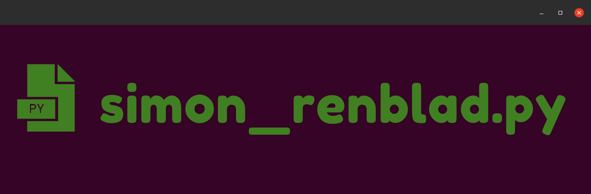

# Hi! I'm Simon!

I am a full-time software engineer. 

Currently I am working on the [ARTIQ software](https://github.com/m-labs/artiq) being developed at [M-Labs](https://m-labs.hk/).

I am currently implementing solutions related to concurrency (asyncio) and networking (TCP and RPC servers) as well as GUI (PyQt).

## Latest Videos

🗳 [Making an API Portal Ep. 2 - Designing our API with Swagger / OpenAPI](https://youtu.be/PJsasr2FZao)

🗳 [Making an API Portal Ep. 1 - Creating a new Serverless Project](https://youtu.be/qPKYQZMqGs0)

🗳 [Making an API Portal Ep. 0 - Using and Creating API Portals on OpenAPIHub](https://youtu.be/dtu5NodvNv4)

## Latest Articles

🗳 [Expose your Airtables with Serverless and AWS Lambda](https://medium.com/@simon.renblad/expose-your-airtables-with-serverless-and-aws-lambda-123dfed1a42e)

### Links

🎞 [YouTube Channel](https://www.youtube.com/channel/UCx4bkeqaZxJXlKqhW96x9mA)

💻 [My Personal Site](https://simonrenblad.github.io/personal-site)

🏅 [Rebound Connect Site](https:/reboundconnect.github.io/site)

💸 [My LinkedIn](https://www.linkedin.com/in/simon-renblad-code)

🐦 [My Twitter](https://twitter.com/simon_renblad)

